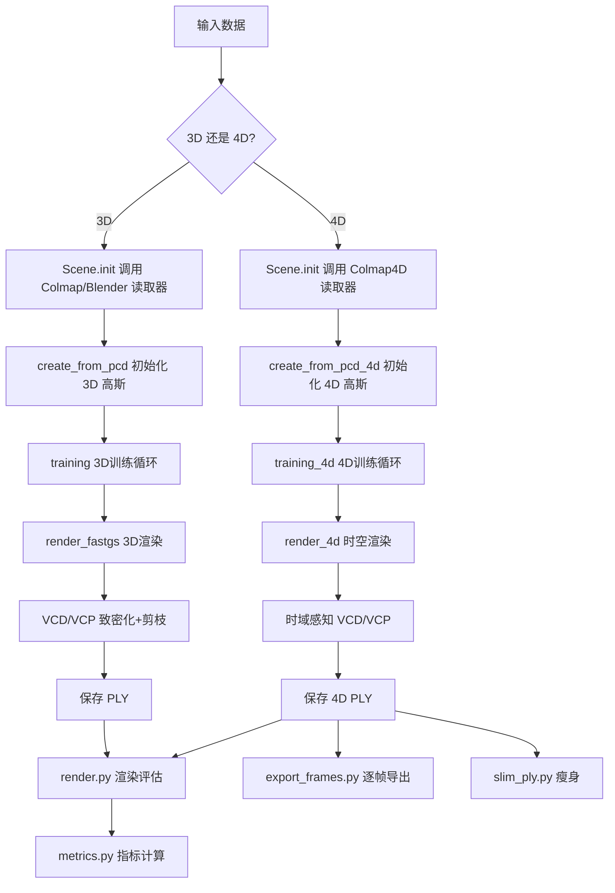
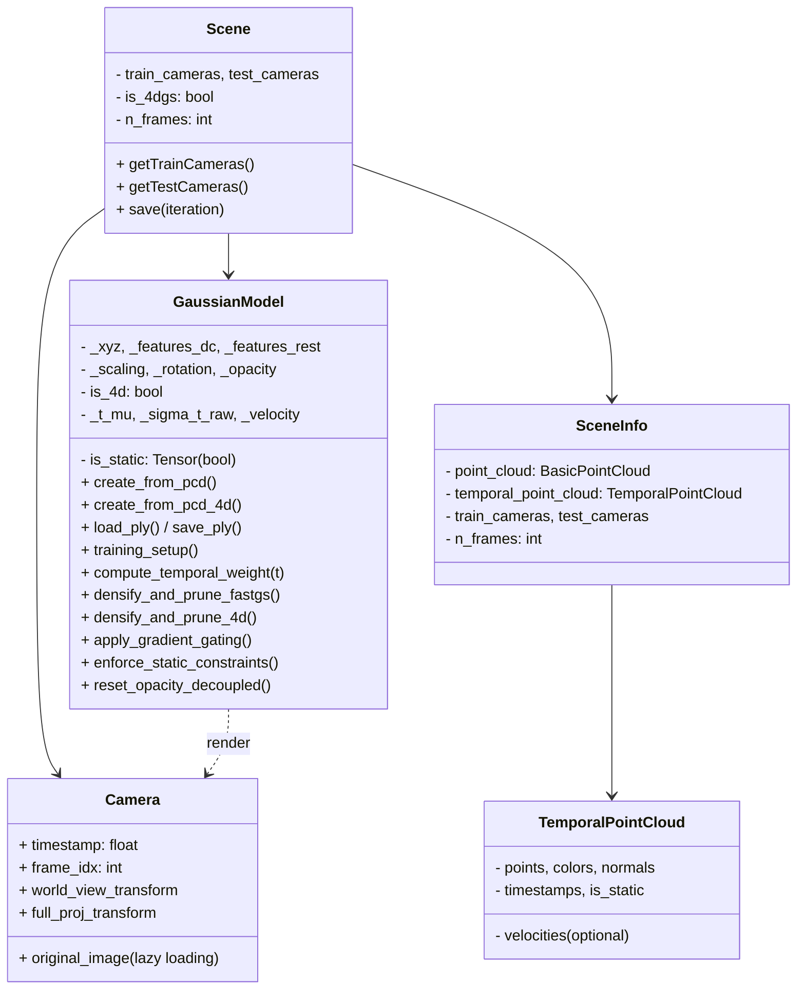

# FastGS / TD-FastGS — 项目全面总结

> **FastGS**: CVPR 2026 论文 — 将 3D Gaussian Splatting 训练加速至 **100 秒**  
> **TD-FastGS**: 在本仓库中实现的时域扩展，支持 **动态场景 4D Gaussian Splatting**

---

## 1. 项目概述

FastGS 是一个通用的 3DGS 加速框架，在原始 3D Gaussian Splatting 基础上引入三项关键改进：
- **多视图一致性致密化 (VCD)**
- **多视图一致性剪枝 (VCP)**
- **Compact Box (CB)**

本仓库 (`fast4dgs`) 在 FastGS 基础上扩展了 **TD-FastGS**（移植自 TD-4DGS 的时域机制），支持动态场景的 4D Gaussian Splatting 训练与渲染。

---

## 2. 目录结构

```
fast4dgs/
├── train.py                          # 主训练脚本（3D + 4D 双入口）
├── render.py                         # 渲染脚本（生成测试/训练视图图像）
├── convert.py                        # COLMAP 数据转换脚本
├── metrics.py                        # 评估指标计算（PSNR, SSIM, LPIPS）
├── export_frames.py                  # 4DGS: 逐帧导出高斯点云 PLY
├── slim_ply.py                       # 4DGS: 对 point_cloud.ply 瘦身（仅保留播放器所需属性）
├── full_eval.py                      # 批量完整评估脚本
├── train_base.sh                     # FastGS 标准模式训练脚本
├── train_big.sh                      # FastGS-Big（高质量）模式训练脚本
├── environment.yml                   # Conda 环境配置
├── README.md                         # 项目说明文档
├── prompt.md                         # TD-FastGS 实现指导文档
│
├── arguments/
│   └── __init__.py                   # 命令行参数定义（ModelParams, PipelineParams, OptimizationParams）
│
├── scene/
│   ├── __init__.py                   # Scene 类：场景管理与数据加载分发
│   ├── gaussian_model.py             # GaussianModel 核心类（含 4D 时域扩展）
│   ├── cameras.py                    # Camera 类（含惰性图像加载、LRU缓存）
│   ├── dataset_readers.py            # 数据读取器（COLMAP, Blender, COLMAP4D）
│   ├── colmap_loader.py              # COLMAP 二进制/文本格式读取
│
├── gaussian_renderer/
│   ├── __init__.py                   # render_fastgs（3D）和 render_4d（4D）渲染函数
│   ├── network_gui.py                # GUI 可视化服务器（旧版）
│   ├── network_gui_ws.py             # GUI 可视化服务器（WebSocket）
│
├── utils/
│   ├── fast_utils.py                 # FastGS 核心工具函数（VCD/VCP评分、4D采样等）
│   ├── loss_utils.py                 # 损失函数（L1, L2, SSIM）
│   ├── image_utils.py                # 图像质量指标（PSNR, MSE）
│   ├── general_utils.py              # 通用工具（逆sigmoid, 学习率调度, 四元数等）
│   ├── graphics_utils.py             # 图形学工具（投影矩阵, FOV计算等）
│   ├── camera_utils.py               # 相机加载工具（惰性路径、分辨率计算）
│   ├── sh_utils.py                   # 球谐函数工具
│   ├── system_utils.py               # 系统工具（文件IO等）
│
├── submodules/
│   ├── diff-gaussian-rasterization_fastgs/  # FastGS 自定义 CUDA 光栅化核
│   ├── fused-ssim/                          # 快速 SSIM CUDA 扩展
│   └── simple-knn/                          # KNN CUDA 扩展（用于初始化）
│
├── tests/
│   └── test_td_fastgs.py             # TD-FastGS 单元测试
│
├── lpipsPyTorch/                     # LPIPS 感知损失（第三方）
│
├── memory/
│   ├── MEMORY.md                     # 内存/数据格式索引
│   └── flower300-data-format.md      # flower300 数据集格式说明
│
├── data/
│   └── flower300/                    # 示例 4D 数据集（36 相机 × 300 帧）
│
└── output/                           # 训练输出目录
```

---

## 3. 核心工作流程

### 3.1 整体流程图



### 3.2 训练流程

训练入口为 `train.py`，参数解析后调用 `training()` 函数。函数自动检测是否为 4DGS 数据集（检测 `static_points/` 和 `dynamic_points/` 目录），然后分派到对应的训练循环：

#### 3D 训练循环 (`training`)
1. 初始化 `GaussianModel` 与 `Scene`
2. 每轮迭代:
   - 随机采样一个训练视角
   - 调用 `render_fastgs` 渲染
   - 计算 L1 + (1-SSIM) 损失
   - 反向传播
   - **致密化阶段** (iter < 15000):
     - 多视图一致性的 clone/split (VCD)
     - 每 3000 步清洗不透明度
   - **后致密化阶段** (iter 15000~30000, 每 3000 步):
     - 多视图一致性剪枝 (VCP)
   - 优化器步进
3. 保存 PLY 点云

#### 4D 训练循环 (`training_4d`)
1. 初始化 `GaussianModel`（含时域属性）
2. 每轮迭代:
   - **3 阶段相机采样**：
     - Stage 1 (≤3000): 仅采样 frame-0（收敛静态背景）
     - Stage 2 (≤10000): 滑动窗口采样（4 帧连续窗口）
     - Stage 3 (>10000): 全局均匀采样
   - 调用 `render_4d` 时空渲染（含因果剪枝）
   - 损失: L1 + (1-SSIM) + λ_v * L_smooth + λ_scale * scale_penalty
   - 反向传播后调用**三级梯度闸门**
   - 时域感知 VCD/VCP（静态/动态点分别使用不同阈值）
   - **解耦不透明度重置**（仅静态点）
   - 优化器步进后调用**静态硬拉回**

### 3.3 渲染流程

#### 3D 渲染 (`render_fastgs`)
1. 设置光栅化配置（投影矩阵、SH 度数等）
2. 提取高斯属性（位置、颜色、不透明度、缩放、旋转）
3. 调用 CUDA 光栅化器生成图像
4. 返回渲染图像、屏幕空间点、可见性过滤、半径、度量计数

#### 4D 渲染 (`render_4d`)
1. **时空变换**: `x'(t) = x₀ + v·(t - t_μ)`, 计算时域权重 `w_t`
2. **因果剪枝**: 仅保留 `t_μ ≤ t` 且 `α·w_t > τ_alive` 的高斯子集
3. 在存活子集上执行 CUDA 光栅化（Compact Box 自动在 kernel 内运行）
4. **回填**: 将子集结果（半径、度量计数）回填到全尺寸张量

---

## 4. 核心算法原理

### 4.1 FastGS 三项改进

| 改进项 | 符号 | 说明 |
|-------|------|------|
| **VCD** | $s^i_d = \frac{1}{K}\sum_j\sum_{p\in\Omega_i}\mathbb{I}(M^j_{mask}(p)=1)$ | 多视图一致性致密化，仅当跨 K 视图的高误差像素计数均值 > τ_d（默认 5）时才 clone/split |
| **VCP** | $s^i_p = \mathcal{N}(\sum_j(\sum_{p\in\Omega_i}\mathbb{I}(M^j_{mask}(p)=1))\cdot E^j_{photo})$ | 多视图一致性剪枝，当 $s^i_p > \tau_p$（默认 0.9）时删除 |
| **CB** | $(\mathbf{p}-\mu)\Sigma^{-1}(\mathbf{p}-\mu)^T \leq \beta(2\ln\frac{\sigma}{\tau_\alpha})$ | Compact Box：用马氏距离代替 3-sigma 规则减少 Gaussian-tile 对 |

### 4.2 TD-FastGS 时域扩展

每个高斯基元附加 **5 个时域属性**：

| 属性 | 符号 | 可学习 | 语义 |
|------|------|--------|------|
| 出生时间 | $t_\mu$ | ❌（冻结） | 锚定于 SfM 帧索引，归一化到 [0,1] |
| 生命半径(log空间) | $\sigma_{t,raw}$ | ✅ | $\sigma_t = e^{\sigma_{t,raw}}$ |
| 运动速度 | $\mathbf{v} \in \mathbb{R}^3$ | ✅（动态点）/ ❌（静态点锁死） | |

**时空变换**:
$$\mathbf{x}'(t) = \mathbf{x}_0 + \mathbf{v} \cdot (t - t_\mu)$$
$$\alpha'_i(t) = \alpha_i \cdot \underbrace{\exp\left(-\frac{(t - t_\mu^{(i)})^2}{2\sigma_t^{(i)2} + \epsilon}\right)}_{w_t^{(i)}(t)}$$

**因果存活条件**:
$$\text{alive}(i, t) = \mathbb{1}[t_\mu^{(i)} \leq t] \wedge \mathbb{1}[\alpha'_i(t) > \tau_{alive}], \quad \tau_{alive} = 0.005$$

### 4.3 三级梯度闸门（4D）

反向传播后、优化器步进前执行：
1. **静态点**: velocity 和 sigma_t_raw 梯度清零
2. **动态 & 当前帧** ($w_t > \text{thresh}$): 所有梯度通过
3. **动态 & 其他帧**: 几何梯度（xyz, features, scaling, rotation）清零，opacity/velocity/sigma_t 保留

### 4.4 速度初始化（从光流估计 3D 速度）

TD-FastGS 支持从**光流**（2D optical flow）自动估计每个动态点的初始 3D 速度，作为高斯属性 $\mathbf{v}$ 的初始值。

#### 数据准备

光流文件放在 `flows/<frame>/<cam_name>.npy` 目录下，每个文件是一个 `(Hf, Wf, 2)` 的 NumPy 数组，存储每个像素在流图坐标系中的 `(du, dv)` 位移。

#### 算法流程 (`load_flow_velocities`)

对于每一个有动态点的帧 $f$：

```mermaid
flowchart TD
    A[动态点云 3D 位置<br/>points_world] --> B[投影到每个相机<br/>p_cam = Rc@p_world + Tc]
    B --> C{深度 > 0.01?}
    C -->|是| D[投影到像素坐标<br/>u,v = fx*x/z+cx, fy*y/z+cy]
    D --> E[缩放到流图分辨率<br/>uf, vf = u*Wf/W_cam, v*Hf/H_cam]
    E --> F{在流图边界内?}
    F -->|是| G[双线性采样光流<br/>→ flow_u, flow_v]
    G --> H[f+1 帧像素位置<br/>u1 = u + flow_u, v1 = v + flow_v]
    H --> I[反投影两个像素到相机空间射线<br/>→ 3D 位移方向]
    I --> J[深度缩放 → 度量位移<br/>dir0 *= depth, dir1 *= depth]
    J --> K[相机空间位移→世界空间<br/>disp_world = Rw @ (dir1 - dir0)]
    K --> L[除以帧间隔 Δt<br/>→ 速度估计]
    L --> M[多相机平均<br/>→ 最终 3D 速度]
```

**关键公式**:

1. **投影到像素**: $u = f_x \cdot \frac{x_c}{z} + c_x$, $v = f_y \cdot \frac{y_c}{z} + c_y$
2. **双线性采光流**: $flow = \sum_{i=0}^1\sum_{j=0}^1 w_{ij} \cdot flow_{v_i,u_j}$
3. **反投影 + 深度缩放**: $\mathbf{dir} = [\frac{u - c_x}{f_x}, \frac{v - c_y}{f_y}, 1] \cdot z$
4. **速度**: $\mathbf{v} = \frac{\mathbf{dir}_1 - \mathbf{dir}_0}{\Delta t}$

#### 数据流

```
flows/<frame>/<cam>.npy       # 2D 光流输入
        ↓
load_flow_velocities()        # 多视图三角化 → 3D 速度
        ↓
load_temporal_point_cloud_pcd()  # 组装 TemporalPointCloud.velocities
        ↓
TemporalPointCloud            # 传入 create_from_pcd_4d()
        ↓
GaussianModel._velocity       # 作为可学习参数初始化
```

#### 回退机制

- 若无 `flows/` 目录 → velocity 初始化为零
- 最后一帧无后续帧光流 → velocity 为零
- 投影到所有相机均不在视野内 → velocity 为零
- 所有静态点 velocity 恒为零（之后由 `enforce_static_constraints` 强制保持）

### 4.5 速度平滑正则化

$$L_{smooth} = \frac{1}{K}\sum_k w_k \cdot ||\mathbf{v}_{a_k} - \mathbf{v}_{b_k}||^2$$
$$w_k = \exp\left(-\frac{||\mathbf{x}_{a_k} - \mathbf{x}_{b_k}||^2}{2\bar{s}^2}\right)$$

随机采样 K=4096 对动态点，以空间距离加权约束速度一致性。

---

## 5. 完整参数列表

### 5.1 模型参数 (ModelParams)

| 参数 | 默认值 | 说明 |
|------|--------|------|
| `--sh_degree` | 3 | 球谐函数阶数（≤3） |
| `--source_path` / `-s` | "" | 数据源路径 |
| `--model_path` / `-m` | "" | 模型输出路径（默认 output/\<random\>） |
| `--images` / `-i` | "images" | 图像子目录名 |
| `--resolution` / `-r` | -1 | 分辨率控制（1/2/4/8 为比例，-1 自动缩放到 1.6K，其他为指定宽度） |
| `--white_background` / `-w` | False | 使用白色背景（NeRF 合成数据集） |
| `--data_device` | "cuda" | 数据存放设备（大数据集建议 "cpu"） |
| `--eval` | False | 使用 MipNeRF360 风格训练/测试拆分 |
| `--force_4dgs` | False | 强制使用 4DGS 数据读取器 |
| `--n_frames` | -1 | 时序帧数（-1 自动推断） |

### 5.2 管线参数 (PipelineParams)

| 参数 | 默认值 | 说明 |
|------|--------|------|
| `--convert_SHs_python` | False | 用 PyTorch 计算 SH 前向/反向 |
| `--compute_cov3D_python` | False | 用 PyTorch 计算 3D 协方差 |
| `--debug` | False | 调试模式 |
| `--antialiasing` | False | 抗锯齿 |

### 5.3 优化参数 (OptimizationParams)

#### 学习率

| 参数 | 默认值 | 说明 |
|------|--------|------|
| `--position_lr_init` | 0.00016 | 位置初始学习率 |
| `--position_lr_final` | 0.0000016 | 位置最终学习率 |
| `--position_lr_delay_mult` | 0.01 | 位置学习率延迟乘数 |
| `--position_lr_max_steps` | 30000 | 位置学习率最大步数 |
| `--feature_lr` | 0.0025 | 特征学习率（旧版兼容） |
| `--lowfeature_lr` | 0.0025 | 低阶 SH 系数 (features_dc) 学习率 |
| `--highfeature_lr` | 0.005 | 高阶 SH 系数 (features_rest) 学习率 |
| `--opacity_lr` | 0.025 | 不透明度学习率 |
| `--scaling_lr` | 0.005 | 缩放学习率 |
| `--rotation_lr` | 0.001 | 旋转学习率 |

#### FastGS 专有参数

| 参数 | 默认值 | 说明 |
|------|--------|------|
| `--loss_thresh` | 0.1 | 损失图阈值（越低保留越多高斯） |
| `--grad_abs_thresh` | 0.0012 | 绝对梯度阈值（split 判断） |
| `--grad_thresh` | 0.0002 | 梯度阈值（clone 判断） |
| `--dense` | 0.001 | 场景范围的百分比，超过则强制致密化 |
| `--mult` | 0.5 | Compact Box 乘数，控制每个 splat 的 tile 数 |
| `--densification_interval` | 100 | 致密化间隔（步数） |
| `--densify_from_iter` | 500 | 开始致密化的迭代 |
| `--densify_until_iter` | 15000 | 结束致密化的迭代 |
| `--opacity_reset_interval` | 3000 | 不透明度重置间隔 |
| `--lambda_dssim` | 0.2 | SSIM 损失权重 |
| `--percent_dense` | 0.001 | 密集点百分比 |
| `--random_background` | False | 随机背景颜色 |
| `--optimizer_type` | "default" | 优化器类型（default / sparse_adam） |

#### TD-FastGS 4D 时域参数

| 参数 | 默认值 | 说明 |
|------|--------|------|
| `--velocity_lr` | 0.0016 | 速度学习率 |
| `--sigma_t_lr` | 0.002 | 时域宽度(log空间)学习率 |
| `--lambda_velocity` | 0.01 | 速度平滑正则化权重 λ_v |
| `--velocity_smooth_pairs` | 4096 | 速度平滑采样的点对数 |
| `--tau_alive` | 0.005 | 因果剪枝不透明度阈值 |
| `--tau_d_static` | 5.0 | 静态点致密化(VCD)阈值 |
| `--tau_d_dynamic` | 2.5 | 动态点致密化(VCD)阈值 |
| `--tau_p` | 0.9 | 剪枝(VCP)阈值 |
| `--wt_densify_thresh` | 0.2 | 致密化/剪枝的活跃窗口阈值 w_t |
| `--wt_current_thresh` | 0.5 | 梯度闸门的"当前帧"阈值 |
| `--static_only_until` | 3000 | Stage 1 边界：之前仅采样 frame-0 |
| `--temporal_window_until` | 10000 | Stage 2 边界：之前滑动窗口采样 |
| `--temporal_window_size` | 4 | Stage 2 滑动窗口宽度（帧数） |
| `--lambda_scale_penalty` | 0.0 | 动态点缩放惩罚权重（0=关闭） |

### 5.4 其他参数

| 参数 | 默认值 | 说明 |
|------|--------|------|
| `--iterations` | 30000 | 总训练迭代数 |
| `--test_iterations` | 7000 30000 | 测试迭代列表 |
| `--save_iterations` | 7000 30000 \<iterations\> | 保存迭代列表 |
| `--checkpoint_iterations` | — | 检查点保存迭代 |
| `--start_checkpoint` | — | 恢复训练的检查点路径 |
| `--debug_from` | — | 开始调试的迭代 |
| `--quiet` | — | 静默模式 |
| `--ip` | 127.0.0.1 | GUI 服务器 IP |
| `--port` | 6009 | GUI 服务器端口 |

### 5.5 后处理工具参数

#### `slim_ply.py`
| 参数 | 默认值 | 说明 |
|------|--------|------|
| `-i` / `--input` | point_cloud.ply | 输入 PLY 路径 |
| `-o` / `--output` | point_cloud_slim.ply | 输出 PLY 路径 |
| `-n` / `--num-frames` | 交互输入 | 动画总帧数 |
| `--vel-threshold` | 0.001 | 速度模长阈值，低于此值视为静态高斯（0 禁用分离） |

#### `export_frames.py`
| 参数 | 默认值 | 说明 |
|------|--------|------|
| `--ply` | 必填 | 训练好的 point_cloud.ply 路径 |
| `--out` | 必填 | 逐帧 PLY 输出目录 |
| `--num_frames` | 80 | 导出帧数 |
| `--threshold` | 0.005 | 剪枝不透明度阈值 |

#### `render.py`
| 参数 | 默认值 | 说明 |
|------|--------|------|
| `--iteration` | -1（最大） | 渲染迭代 |
| `--skip_train` | False | 跳过训练集渲染 |
| `--skip_test` | False | 跳过测试集渲染 |
| `--mult` | 0.5 | Compact Box 乘数 |

#### `convert.py`
| 参数 | 说明 |
|------|------|
| `-s` / `--source_path` | 源路径（必填） |
| `--camera` | 相机模型（默认 OPENCV） |
| `--colmap_executable` | COLMAP 可执行文件路径 |
| `--resize` | 是否生成缩放图像（2×/4×/8×） |
| `--skip_matching` | 跳过特征提取与匹配 |

---

## 6. 数据格式

### 6.1 3D 数据集格式

#### COLMAP 格式
```
dataset/
├── sparse/0/
│   ├── cameras.bin (.txt)   # 相机内参
│   ├── images.bin (.txt)    # 图像外参
│   └── points3D.bin (.txt)  # SfM 点云
├── images/                   # 输入图像
└── input/                    # (可选) convert.py 原始输入
```

#### Blender/NeRF 合成格式
```
dataset/
├── transforms_train.json     # 训练集变换
├── transforms_test.json      # 测试集变换
└── points3d.ply              # 初始点云（无 COLMAP 时自动生成随机点）
```

### 6.2 4D 数据集格式 (flower300 布局)

```
dataset/
├── sparse/0/
│   ├── cameras.txt           # 相机标定（36 个固定视角）
│   ├── images.txt            # 图像名（1.png~36.png = 相机 ID）
│   └── points3D.txt          # 可能为空（点云来自下面 PLY）
├── images/
│   ├── <frame>/
│   │   └── images/
│   │       ├── 1.png         # 相机 1 在该帧的图像
│   │       ├── 2.png
│   │       └── ...           # ~36 张/帧
│   ├── ...                   # frames 1~N（如 300）
├── static_points/
│   └── pcd1.ply              # 静态背景点云（~17k 点, t_mu=0）
├── dynamic_points/
│   ├── pcd<frame>.ply         # 逐帧动态点云（~2300 点/帧）
├── flows/                     # (可选) 光流用于初始化 3D 速度
    ├── <frame>/               # 帧目录，如 1/, 2/, ...
    │   ├── 1.npy              # 相机 1 的 2D 光流 (Hf, Wf, 2)
    │   ├── 2.npy
    │   └── ...                # 每个相机一个 .npy 文件
```

### 6.3 4D PLY 属性

| 属性 | 类型 | 说明 |
|------|------|------|
| `x, y, z` | float | 位置 |
| `f_dc_0, f_dc_1, f_dc_2` | float | 低阶 SH 系数（DC） |
| `f_rest_0..n` | float | 高阶 SH 系数 |
| `opacity` | float | 不透明度（原始值，需 sigmoid） |
| `scale_0, scale_1, scale_2` | float | 缩放（log 空间） |
| `rot_0, rot_1, rot_2, rot_3` | float | 旋转四元数 |
| `t_mu` | float | 出生时间（归一化到 [0,1]） |
| `sigma_t_raw` | float | 生命半径（log 空间） |
| `vel_x, vel_y, vel_z` | float | 运动速度 |
| `is_static` | float | 是否为静态点（0 或 1） |

`slim_ply.py` 输出使用 DT-4DGS 标准命名（`t_sigma`, `velocity_0/1/2`）。

---

## 7. 训练模式

### 7.1 标准模式 (FastGS)

`train_base.sh` — `--densification_interval 500`
- 约 100 秒完成训练（RTX 4090）
- 适合快速原型和大多数场景

### 7.2 高质量模式 (FastGS-Big)

`train_big.sh` — `--densification_interval 100`
- 使用 `--mode final_count`，为每个场景预设高斯数量上限
- 场景特定的 `big_budgets`（如 bicycle: 598万, room: 154万）
- 训练时间略长，质量更高

### 7.3 Budget 模式

`full_eval.py --mode budget`
- 使用 `--mode multiplier` 和场景特定的预算乘数
- 用于批量评估

---

## 8. 完整评估流程

```
1. 数据准备: python convert.py -s <dataset_path>   # COLMAP SfM
2. 训练:      python train.py -s <source> -m <output> [options]
3. 渲染:      python render.py -m <model_path> [--skip_train] [--mult x]
4. 指标:      python metrics.py -m <model_path>
```

### 4D 后处理流程
```
5. 瘦身:      python slim_ply.py -i point_cloud.ply -o slim.ply -n <num_frames>
6. 逐帧导出:  python export_frames.py --ply point_cloud.ply --out frames/ --num_frames <N>
```

### 批量完整评估
```
python full_eval.py -m360 <mipnerf360_path> -tat <tandt_path> -db <db_path> [--mode big|budget]
```

---

## 9. 关键类图



---

## 10. 依赖与环境

| 组件 | 版本 |
|------|------|
| Python | 3.7.13 |
| PyTorch | 1.12.1 |
| CUDA Toolkit | 11.6 |
| torchvision | 0.13.1 |
| torchaudio | 0.12.1 |
| CUDA 编译器 (nvcc) | ≥ 11.8 |
| 系统 CUDA (nvidia-smi) | ≥ 12.2 |

**子模块**（需编译的 CUDA 扩展）：
- `diff-gaussian-rasterization_fastgs` — FastGS 自定义光栅化器
- `simple-knn` — KNN 距离计算
- `fused-ssim` — 快速 SSIM

---

## 11. 性能指标

| 数据集 | FastGS 训练时间 | FastGS-Big 训练时间 | 对比 3DGS |
|--------|:-:|:-:|:-:|
| Mip-NeRF 360 (室外) | ~100s | ~2min | 3.32× DashGaussian |
| Mip-NeRF 360 (室内) | ~80s | ~1.5min | — |
| Deep Blending | ~60s | ~1min | 15.45× 加速 |
| Tanks&Temples | ~70s | ~1.5min | — |

---

## 12. 注意事项

1. **静态点初始化**: `sigma_t_raw = log(1000)` → 时域权重 ≈ 1，全场可见
2. **动态点初始化**: `sigma_t_raw = log(2.5/n_frames)` → 覆盖约 2.5 帧
3. **速度初始化**: 优先从 `flows/<frame>/` 目录下的 2D 光流 `.npy` 文件估算。若无光流则速度初始化为零，训练过程中由速度平滑正则化驱动收敛
4. **静态硬拉回**: 每步优化后，静态点的 `velocity=0`、`sigma_t_raw=log(1000)`、`t_mu=0`，并清空 Adam 动量
5. **LRU 图像缓存**: Camera 类使用有界 LRU 缓存（默认 64 张），避免 4D 数据集大量图像同时驻留 GPU
6. **窗口系统兼容性**: 终端使用 Windows PowerShell，不支持 `&&` 链式命令
